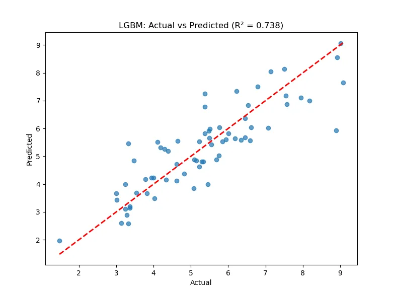
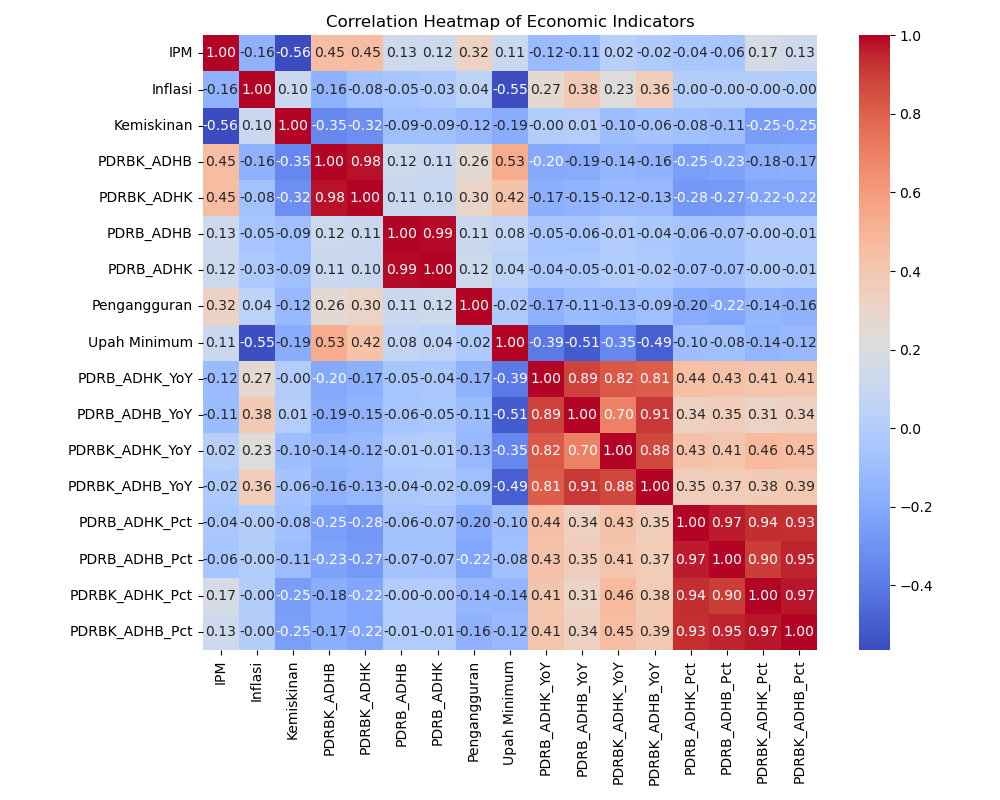
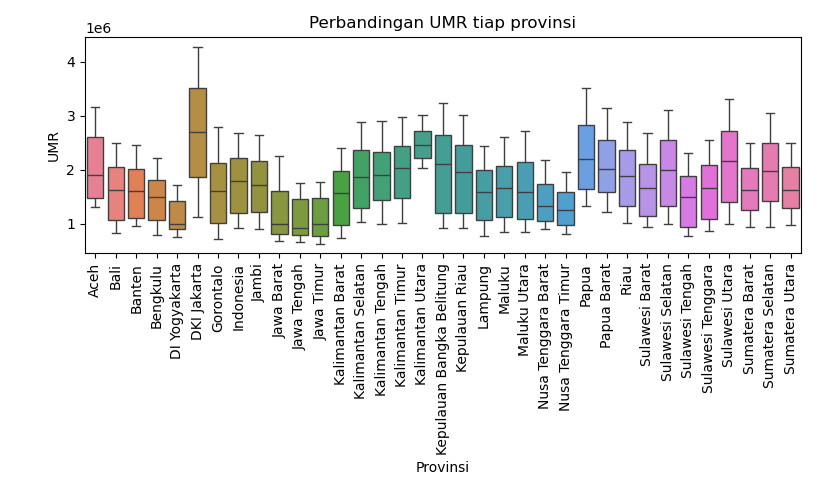
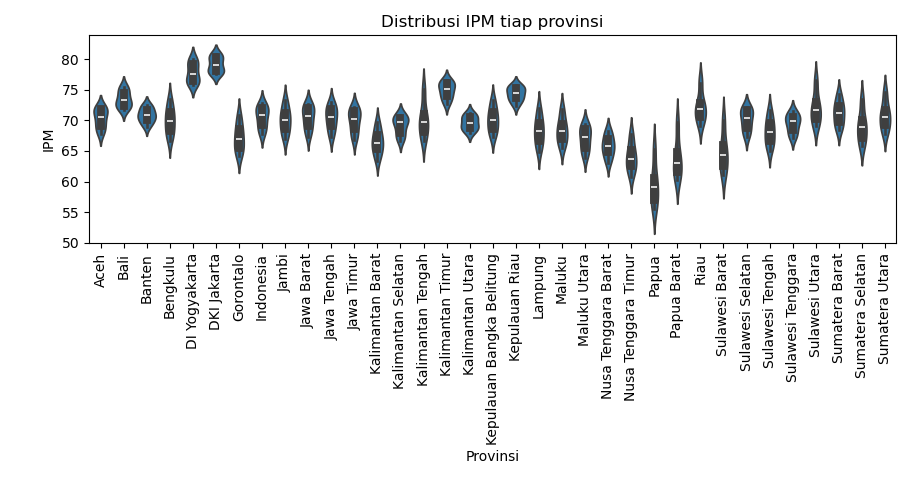
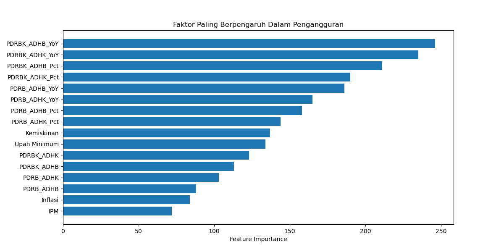
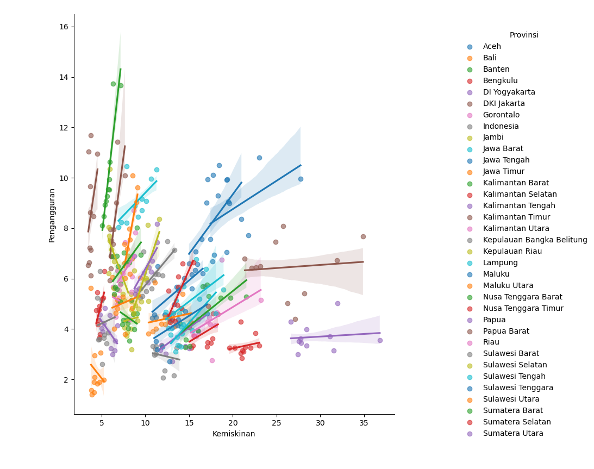

# 🇮🇩 Indonesia 2045 - Economic Prediction

A beginner-friendly machine learning project that aims to explore how to roughly predict socioeconomal condition using hypothetical scenarios such as 'Optimistic' and 'Stagnant'. This project is designed for educational purposes, helping me get hands-on experience with data science workflows, regression models, and exploratory data analysis (EDA).

## 🧠 Objectives

- Predict future economic indicators for Indonesia (or specific provinces like Yogyakarta).
- Practice basic ML algorithms such as Linear Regression, Decision Trees, or Ensemble methods.
- Learn how to work with real-world socio-economic data from trusted sources (BPS, World Bank, etc.).
- Understand feature selection, data preprocessing, and model evaluation in a real context.

## 📊 Features / Parameters Used

Some of the economic indicators and features used or considered:

- Human Development Index (HDI / IPM)
- Poverty Rate 
- Unemployment Rate
- Minimum Wage
- Gross Regional Domestic Product (PDRB ADHB / ADHK)
- Gross Regional Domestic Product per Capita (PDRBK ADHB / ADHK)

## 📌 Key Tools & Libraries

- Python 3
- pandas, numpy
- matplotlib, seaborn
- scikit-learn
- jupyter
- XGtools
- LightBGM

## 📊 Model Performance (R² Score)

| Model              | R² Score            |
|--------------------|---------------------|
| Random Forest       | 0.7317              |
| Grid Search CV      | 0.6176              |
| Linear Regression   | 0.0005              |
| XGB Regressor       | 0.7226              |
| LGBM Regressor      | **0.7378** (Best)   |

## 📝 Notes

- Accuracy is **not** the main goal — the project is intended for **learning and exploration**.
- Model assumptions are simplistic and not suitable for policy or forecasting use.
- Open to feedback and collaboration!

## 📷 Visual Examples

- Figure 1: Predicted vs Actual graph

- Figure 2: Correlation Heatmap

- Figure 3: Minimum Wage per Provinces

- Figure 4: Violin Plot

- Figure 5: Feature Importances

- Figure 6: Kemiskinan vs Pengangguran correlation
